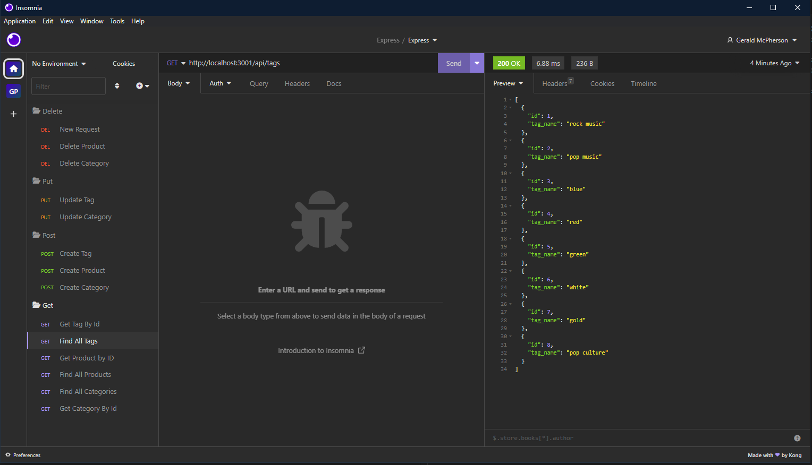

E-Commerce DataBase
Description.
A database that uses sequlize

Table of Contents
- [Installation](#installation)
- [Usage](#usage)
- [License](#license)
- [Contributing](#contribution)
- [Tests](#tests)
- [Questions](#questions)

## INSTALLATION
Npm I

## USAGE
Npm run Seed
Npm Start

## LICENSE
The license used in this program is MIT License

## CONTRIBUTION
Gerald McPherson

## TESTS
No tests done

## QUESTIONS
If you have any questions please reach out to me on github at GerryRaldO or email me at gerald@blackberryhill.net!

https://github.com/GerryRaldO/ECommerce
